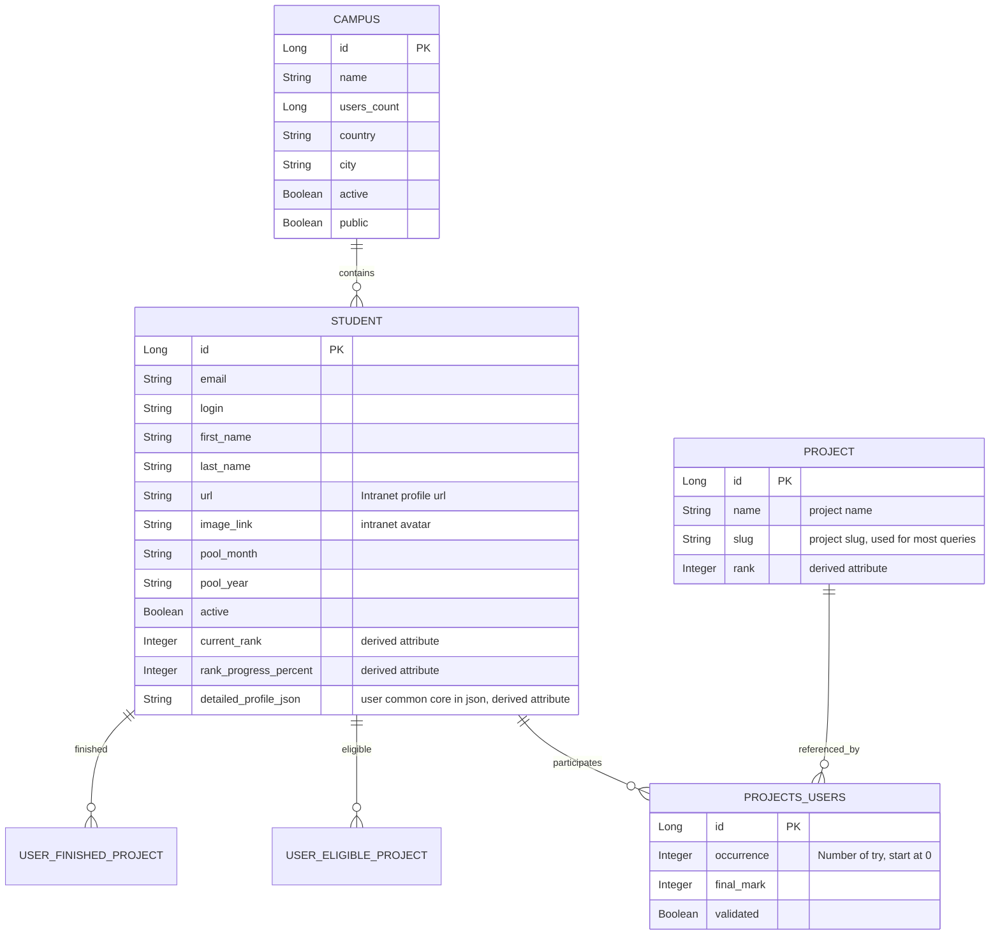

# IMPORTANT TODO
- JWT access token validation for all API endpoints.
- JWT validation for PATCH and DELETE endpoints for stateless session. As result, user validation will be through JWT instead of {id} for security reason.

# Description
**Api 42 service** is a microservice to manage students from 42.
 This service fetches, transforms and stores data from official 42 API to update students profile. Students can also upload their own avatar, banner and LFG status.
 REST endpoints are exposed to API Gateway for communication.

Tech stacks: Java Spring Boot, JPA (Hibernate ORM) and PostgreSQL.

Module:
  <ul>
    <li>Use a backend framework. (1p)</li>
    <li>Use an ORM for the database. (1p)</li>
    <li>Implement advanced search functionality with filters, sorting, and pagination. (1p)</li>
    <li>Allow users to interact with other users. (part - user profile)</li>
    <li>Standard user management and authentication. (part - update profile, upload avatar, profile)</li>
    <li>Backend as microservice. (part)</li>
  </ul>

Member worked on: Nguyen NGUYEN (hoannguy).
 

 

# Instructions
### Requirements
* Docker: `Docker version 28.2.2`
* Docker compose: `Docker Compose version v5.0.1`
* env file location: `backend/api42-service/.env`
  * 

    
Example of env file

    <pre>H2_URL=jdbc:h2:./data/users.db
     H2_USER=
     H2_PASS=
     
     POSTGRES_URL=
     POSTGRES_USER=
     POSTGRES_PASS=
     
     API42_UID=
     API42_SECRET=
     API42_NEXT_SECRET=
    </pre>

  
### Start as individual service
* Run locally <pre>export $(grep -v '^#' .env | xargs) ./mvnw spring-boot:run -Dspring-boot.run.profiles=dev</pre>
* Using Docker <pre>docker build . -t api42-service docker run --env-file .env -p 4444:4444 api42-service:latest</pre>

 

# API Documentation
Currently only support Lausanne campus

  
User API

    

      
<code>GET /v1/42users</code>

      <ul>
        <li>Description: Get all active and non alumni users. Note: Rank 7 mean user has done all rank 6 projects.</li>
        <li>Filter:
          <ul>
            <li><code>campusName</code> (mandatory, Lausanne only)</li>
            <li><code>poolMonth</code></li>
            <li><code>poolYear</code></li>
            <li><code>rank</code></li>
            <li><code>eligibleProject</code> (a project user can do but hasn't done)</li>
            <li><code>finishedProjects</code> (list of finished projects)</li>
            <li><code>lfg</code></li>
          </ul>
        </li>
        <li>Sorting:
          <ul>
            <li><code>poolYear</code></li>
            <li><code>rank</code></li>
            <li><code>rankProgressPercent</code></li>
          </ul>
        </li>
        <li>Paging:
          <ul>
            <li><code>page</code> (page number, start from 0)</li>
            <li><code>size</code> (results per page, default 25, max 50)</li>
          </ul>
        </li>
        <li>Examples:
          <ul>
            <li><pre>/v1/42users?page=0&size=50&campusName=Lausanne&poolMonth=june&poolYear=2024&rank=6&eligibleProject=ft_transcendence&finishedProjects=webserv&finishedProjects=cub3d</pre></li>
            <li><pre>/v1/42users?campusName=Lausanne&page=0&size=25&sort=rank,desc&poolMonth=june</pre></li>
          </ul>
        </li>
        <li>
          

            
Json response example:

            <ul>
              <li>Request:<pre>/v1/42users?campusName=Lausanne&page=0&size=2&sort=rank,desc&poolMonth=june</pre></li>
              <li>Response:
                <pre><code class="language-json">
                  {
                    "content": [
                      {
                        "id": 111111,
                        "login": "user1Login",
                        "first_name": "User1 First Name",
                        "last_name": "User1 Last Name",
                        "intra_url": "https://intra.42.fr/users/user1Login",
						"custom_avatar_url": null,
    					"custom_banner_url": "http://localhost:4444/images42/default_profile_banner.jpg",
                        "image": {
                          "link": "url to original user1 photo",
                          "versions": {
                            "large": "url to large user1 photo",
                            "medium": "url to medium user1 photo",
                            "small": "url to small user1 photo",
                            "micro": "url to micro user1 photo"
                          }
                        },
                        "pool_month": "june",
                        "pool_year": "2024",
                        "rank": 7,
                        "rank_progress_percent": 0,
                        "lfg": "none"
                      },
                      {
                        "id": 222222,
                        "login": "user2Login",
                        "first_name": "User2 First Name",
                        "last_name": "User2 Last Name",
                        "intra_url": "https://intra.42.fr/users/user2Login",
						"custom_avatar_url": null,
    					"custom_banner_url": "http://localhost:4444/images42/default_profile_banner.jpg",
                        "image": {
                          "link": "url to original user2 photo",
                          "versions": {
                            "large": "url to large user2 photo",
                            "medium": "url to medium user2 photo",
                            "small": "url to small user2 photo",
                            "micro": "url to micro user2 photo"
                          }
                        },
                        "pool_month": "june",
                        "pool_year": "2023",
                        "rank": 6,
                        "rank_progress_percent": 34,
                        "lfg": "ft_transcendence"
                      }
                    ],
                    "page": {
                      "size": 2,
                      "number": 0,
                      "totalElements": 122,
                      "totalPages": 61
                    }
                  }
                </code></pre>
              </li>
            </ul>
          

        </li>
      </ul>
    

    

      
<code>GET /v1/42users/{id}/profile</code>

      <ul>
        <li>Description: Get a user by id.</li>
        <li>Example<pre>/v1/42users/111111/profile</pre></li>
        <li>
          

            
Json response example

            <ul>
              <li>Request:<pre>/v1/42users/111111/profile</pre></li>
              <li>Response:
                <pre><code class="language-json">
                  {
                    "id": 111111,
                    "campus": "Lausanne",
                    "email": "email@student.42lausanne.ch",
                    "login": "userLogin",
                    "first_name": "User First Name",
                    "last_name": "User Last Name",
                    "intra_url": "https://intra.42.fr/users/userLogin",
					"custom_avatar_url": null,
					"custom_banner_url": "http://localhost:4444/images42/default_profile_banner.jpg",
                    "image": {
                      "link": "url to original user photo",
                      "versions": {
                        "large": "url to large user photo",
                        "medium": "url to medium user photo",
                        "small": "url to small user photo",
                        "micro": "url to micro user photo"
                      }
                    },
                    "pool_month": "june",
                    "pool_year": "2024",
                    "alumni": false,
                    "active": true,
                    "rank": 6,
                    "rank_progress_percent": 0,
                    "lfg": "42_collaborative_resume",
                    "finished_projects": [
                      "cpp-module-00",
                      // ... list of finished projects
                      "42cursus-push_swap"
                    ],
                    "eligible_projects": [
                      "exam-rank-06",
                      // ... list of eligible projects
                      "42_collaborative_resume"
                    ],
                    "common_core": {
                      "rank": [
                        {
                          "rank": 0,
                          "projects": [
                            {
                              "cursus_project_id": 1314,
                              "name": "Libft",
                              "slug": "42cursus-libft",
                              "projects_users": {
                                "occurrence": 0,
                                "final_mark": 124,
                                "status": "finished",
                                "validated": true
                              }
                            }
                          ]
                        },
                        // ... other ranks
                        {
                          "rank": 6,
                          "projects": [
                            {
                              "cursus_project_id": 2623,
                              "name": "42_Collaborative_resume",
                              "slug": "42_collaborative_resume",
                              "projects_users": {
                                "occurrence": 0,
                                "final_mark": null,
                                "status": "creating_group",
                                "validated": null
                              }
                            }
                          ]
                        }
                      ]
                    }
                  }
                </code></pre>
              </li>
            </ul>
          

        </li>
      </ul>
    

    

      
<code>GET /v1/42users/last_name/{lastName}</code>

      <ul>
        <li>Description: Get all users by last name. Name is case-sensitive.</li>
        <li>No filter and no sorting.</li>
		<li>Paging:
          <ul>
            <li><code>page</code> (page number, start from 0)</li>
            <li><code>size</code> (results per page, default 25, max 50)</li>
          </ul>
        </li>
        <li>Example<pre>/v1/42users/last_name/User</pre></li>
        <li>
          

            
Json response example

            <ul>
              <li>Request:<pre>/v1/42users/last_name/User</pre></li>
              <li>Response:
                <pre><code class="language-json">
				{
					"content": [
					  {
					    "id": 111111,
					    "login": "user1",
					    "first_name": "User1 First Name",
					    "last_name": "User",
					    "intra_url": "https://intra.42.fr/users/user1",
						"custom_avatar_url": null,
    					"custom_banner_url": "http://localhost:4444/images42/default_profile_banner.jpg",
					    "image": {
						  "link": "url to original user photo",
						  "versions": {
						    "large": "url to large user photo",
						    "medium": "url to medium user photo",
						    "small": "url to small user photo",
						    "micro": "url to micro user photo"
						  }
					    },
					    "rank": null,
					    "rank_progress_percent": null,
                        "lfg": "none"
					  },
					  {
					    "id": 222222,
					    "login": "user2",
					    "first_name": "User2 First Name",
					    "last_name": "User",
					    "intra_url": "https://intra.42.fr/users/user2",
						"custom_avatar_url": null,
    					"custom_banner_url": "http://localhost:4444/images42/default_profile_banner.jpg",
					    "image": {
						  "link": "url to original user photo",
						  "versions": {
						    "large": "url to large user photo",
						    "medium": "url to medium user photo",
						    "small": "url to small user photo",
						    "micro": "url to micro user photo"
						  }
					    },
					    "rank": 4,
					    "rank_progress_percent": 75,
                        "lfg": "none"
					  }
                  	],
					"page": {
					  "size": 25,
					  "number": 0,
					  "totalElements": 2,
					  "totalPages": 1
				    }
				  }
                </code></pre>
              </li>
            </ul>
          

        </li>
      </ul>
    

    

      
<code>GET /v1/42users/first_name/{firstName}</code>

      <ul>
        <li>Description: Get all users by first name. Name is case-sensitive.</li>
        <li>No filter and not sorting.</li>
		<li>Paging:
          <ul>
            <li><code>page</code> (page number, start from 0)</li>
            <li><code>size</code> (results per page, default 25, max 50)</li>
          </ul>
        </li>
        <li>Example<pre>/v1/42users/first_name/User%20First%20Name</pre></li>
        <li>
          

            
Json response example

            <ul>
              <li>Request:<pre>/v1/42users/first_name/User%20First%20Name</pre></li>
              <li>Response:
                <pre><code class="language-json">
                  {
					"content": [
					  {
					    "id": 111111,
					    "login": "user1",
					    "first_name": "User First Name",
					    "last_name": "UserNumber1",
					    "intra_url": "https://intra.42.fr/users/user1",
						"custom_avatar_url": null,
    					"custom_banner_url": "http://localhost:4444/images42/default_profile_banner.jpg",
					    "image": {
						  "link": "url to original user photo",
						  "versions": {
						    "large": "url to large user photo",
						    "medium": "url to medium user photo",
						    "small": "url to small user photo",
						    "micro": "url to micro user photo"
						  }
					    },
					    "rank": null,
					    "rank_progress_percent": null,
                        "lfg": "none"
					  },
					  {
					    "id": 222222,
					    "login": "user2",
					    "first_name": "User First Name",
					    "last_name": "UserNumber2",
					    "intra_url": "https://intra.42.fr/users/user2",
					    "image": {
						  "link": "url to original user photo",
						  "versions": {
						    "large": "url to large user photo",
						    "medium": "url to medium user photo",
						    "small": "url to small user photo",
						    "micro": "url to micro user photo"
						  }
					    },
					    "rank": 4,
					    "rank_progress_percent": 75,
                        "lfg": "none"
					  }
                  	],
					"page": {
					  "size": 25,
					  "number": 0,
					  "totalElements": 2,
					  "totalPages": 1
				    }
				  }
                </code></pre>
              </li>
            </ul>
          

        </li>
      </ul>
    

    

      
<code>PATCH v1/42users/{id}/lfg?lfg={eligibleProject}</code> Attention: {id} will be deleted and user will be validated with JWT instead.

      <ul>
        <li>Description: Update user LFG project. Note: query lfg={eligibleProject] is mandatory.</li>
        <li>Query option: An eligible project (slug) of user or "none"</li>
        <li>Response code:
          <ul>
            <li>204: LFG is successfully updated</li>
            <li>400: No lfg query (check lfg format)</li>
            <li>400: Invalid lfg project. Only eligible projects or none are accepted.</li>
          </ul>
        </li>
        <li>Example<pre>/v1/42users/188455/lfg?lfg=none</pre></li>
      </ul>
    

    

      
<code>PATCH v1/42users/{id}/avatar</code> Attention: {id} will be deleted and user will be validated with JWT instead.

      <ul>
        <li>Description: Update user avatar.</li>
        <li>Require: 
          <ul>
            <li>Header: <code>Content-Type: multipart/form-data</code></li>
            <li>FormData must have "avatar" as key and the file to upload as value.</li>
            <li>Only .gif, .jpg, .jpeg, .png, .webp</li>
          </ul>
        </li>
        <li>Response code:
          <ul>
            <li>200: Successfully modified avatar</li>
            <li>400: Request must be multipart/form-data</li>
            <li>400: Invalid file (empty, not image) or no/wrong Content-Type header</li>
            <li>400: Invalid file extension. Allowed: .gif, .jpg, .jpeg, .png, .webp</li>
            <li>500: IO runtime error in server</li>
          </ul>
        </li>
        <li>Example<pre>/v1/42users/188455/avatar</pre></li>
      </ul>
    

    

      
<code>DELETE v1/42users/{id}/avatar</code> Attention: {id} will be deleted and user will be validated with JWT instead.

      <ul>
        <li>Description: Delete user avatar.</li>
        <li>Response code:
          <ul>
            <li>200: Successfully deleted avatar</li>
            <li>404: File not found</li>
            <li>500: IO runtime error in server</li>
          </ul>
        </li>
        <li>Example<pre>/v1/42users/188455/avatar</pre></li>
      </ul>
    

    

      
<code>PATCH v1/42users/{id}/banner</code> Attention: {id} will be deleted and user will be validated with JWT instead.

      <ul>
        <li>Description: Update user banner.</li>
        <li>Require: 
          <ul>
            <li>Header: <code>Content-Type: multipart/form-data</code></li>
            <li>FormData must have "banner" as key and the file to upload as value.</li>
            <li>Only .gif, .jpg, .jpeg, .png, .webp</li>
          </ul>
        </li>
        <li>Response code:
          <ul>
            <li>200: Successfully modified banner</li>
            <li>400: Request must be multipart/form-data</li>
            <li>400: Invalid file (empty, not image) or no/wrong Content-Type header</li>
            <li>400: Invalid file extension. Allowed: .gif, .jpg, .jpeg, .png, .webp</li>
            <li>500: IO runtime error in server</li>
          </ul>
        </li>
        <li>Example<pre>/v1/42users/188455/banner</pre></li>
      </ul>
    

    

      
<code>DELETE v1/42users/{id}/banner</code> Attention: {id} will be deleted and user will be validated with JWT instead.

      <ul>
        <li>Description: Delete user banner.</li>
        <li>Response code:
          <ul>
            <li>200: Successfully deleted banner</li>
            <li>404: File not found</li>
            <li>500: IO runtime error in server</li>
          </ul>
        </li>
        <li>Example<pre>/v1/42users/188455/banner</pre></li>
      </ul>
    

 

	
Campus API

	

    
<code>GET /v1/campuses</code>

    <ul>
      <li>Description: Get all active and public campuses.</li>
      <li>Filter list:
        <ul>
          <li><code>name</code></li>
          <li><code>country</code></li>
          <li><code>city</code></li>
        </ul>
      </li>
      <li>Sorting list:
        <ul>
          <li><code>name</code></li>
          <li><code>country</code></li>
          <li><code>city</code></li>
		  <li><code>usersCount</code></li>
        </ul>
      </li>
      <li>Paging:
		<ul>
		  <li><code>page</code> (page number, start from 0)</li>
		  <li><code>size</code> (results per page, default 25, max 50)</li>
		</ul>
	  </li>
	  <li>Example:
		<ul>
		  <li><pre>/v1/campuses?page=0&sort=name,asc&country=Spain</pre></li>
		</ul>
	  </li>
	  <li>
		

			
response example

			<ul>
			  <li>Request:
				<pre>/v1/campuses?page=0&sort=name,asc&country=Spain</pre>
			  </li>
			  <li>Response:
				<pre><code class="language-json">
				  {
					  "content": [
						{
						  "id": 51,
						  "name": "Berlin",
						  "time_zone": "Europe/Berlin",
						  "users_count": 3047,
						  "country": "Germany",
						  "address": "Harzer Strasse 39",
						  "zip": "12059",
						  "city": "Berlin",
						  "website": "https://42berlin.de/",
						  "facebook": "",
						  "twitter": "",
						  "active": true,
						  "public": true,
						  "email_extension": "42berlin.de"
						},
						{
						  "id": 39,
						  "name": "Heilbronn",
						  "time_zone": "Europe/Berlin",
						  "users_count": 3097,
						  "country": "Germany",
						  "address": "Weipertstr 8 - 10",
						  "zip": "74076",
						  "city": "Heilbronn",
						  "website": "https://42heilbronn.de/",
						  "facebook": "https://www.facebook.com/42heilbronn",
						  "twitter": "https://twitter.com/42Heilbronn",
						  "active": true,
						  "public": true,
						  "email_extension": "42heilbronn.de"
						},
						{
						  "id": 44,
						  "name": "Wolfsburg",
						  "time_zone": "Europe/Berlin",
						  "users_count": 3660,
						  "country": "Germany",
						  "address": "Porschestraße 2c",
						  "zip": "38440",
						  "city": "Wolfsburg",
						  "website": "https://42wolfsburg.de/",
						  "facebook": "",
						  "twitter": "",
						  "active": true,
						  "public": true,
						  "email_extension": "42wolfsburg.de"
						}
					  ],
					  "page": {
						"size": 25,
						"number": 0,
						"totalElements": 3,
						"totalPages": 1
					  }
					}
				</code></pre>
			  </li>
			</ul>
		

	  </li>
    </ul>
  

	

    
<code>GET /v1/campuses/id/{id}</code>

    <ul>
      <li>Description: Get a campus by id.</li>
      <li>No filter, no sorting and no paging.</li>
	  <li>Example:
		<ul>
		  <li><pre>/v1/campuses/id/51</pre></li>
		</ul>
	  </li>
	  <li>
		

			
response example

			<ul>
			  <li>Request:
				<pre>/v1/campuses/id/51</pre>
			  </li>
			  <li>Response:
				<pre><code class="language-json">
				  {
					  "id": 51,
					  "name": "Berlin",
					  "time_zone": "Europe/Berlin",
					  "users_count": 3047,
					  "country": "Germany",
					  "address": "Harzer Strasse 39",
					  "zip": "12059",
					  "city": "Berlin",
					  "website": "https://42berlin.de/",
					  "facebook": "",
					  "twitter": "",
					  "active": true,
					  "public": true,
					  "email_extension": "42berlin.de"
				  }
				</code></pre>
			  </li>
			</ul>
		

	  </li>
    </ul>
  

	

    
<code>GET /v1/campuses/name/{name}</code>

    <ul>
      <li>Description: Get all active and public campuses by campus name. Name is case-sensitive.</li>
      <li>No filter and no sorting.
      </li>
      <li>Paging:
		<ul>
		  <li><code>page</code> (page number, start from 0)</li>
		  <li><code>size</code> (results per page, default 25, max 50)</li>
		</ul>
	  </li>
	  <li>Example:
		<ul>
		  <li><pre>/v1/campuses/name/Lausanne</pre></li>
		</ul>
	  </li>
	  <li>
		

			
response example

			<ul>
			  <li>Request:
				<pre>/v1/campuses/name/Lausanne</pre>
			  </li>
			  <li>Response:
				<pre><code class="language-json">
				  {
					  "content": [
					    {
					      "id": 47,
					      "name": "Lausanne",
					      "time_zone": "Europe/Zurich",
					      "users_count": 2251,
					      "country": "Switzerland",
					      "address": "64 Rue de Lausanne",
					      "zip": "1020",
					      "city": "Renens",
					      "website": "https://42lausanne.ch/",
					      "facebook": "https://www.facebook.com/42Lausanne",
					      "twitter": "https://twitter.com/42lausanne",
					      "active": true,
					      "public": true,
					      "email_extension": "42lausanne.ch"
					    }
					  ],
					  "page": {
					    "size": 25,
					    "number": 0,
					    "totalElements": 1,
					    "totalPages": 1
					  }
					}
				</code></pre>
			  </li>
			</ul>
		

	  </li>
    </ul>
  

 

	
Common Core API

	

    
<code>GET /v1/commoncore</code>

    <ul>
      <li>Description: Get the current Common Core projects.</li>
      <li>No filter, no sorting and no paging.</li>
	  <li>Example:
		<ul>
		  <li><pre>/v1/commoncore</pre></li>
		</ul>
	  </li>
	  <li>
		

			
response example

			<ul>
			  <li>Request:
				<pre>/v1/commoncore</pre>
			  </li>
			  <li>Response:
				<pre><code class="language-json">
				  {
					  "projects": [
					    {
					      "id": 1314,
					      "name": "Libft",
					      "slug": "42cursus-libft",
					      "rank": 0
					    },
					        // ... More projects
					    {
					      "id": 2309,
					      "name": "CPP Module 09",
					      "slug": "cpp-module-09",
					      "rank": 5
					    },
					    {
					      "id": 2623,
					      "name": "42_Collaborative_resume",
					      "slug": "42_collaborative_resume",
					      "rank": 6
					    }
					  ],
					  "ranks": {
					    "0": {
					      "mandatory": [
					        "42cursus-libft"
					      ],
					      "choices": []
					    },
					    "1": {
					      "mandatory": [
					        "42cursus-get_next_line",
					        "42cursus-ft_printf",
					        "born2beroot"
					      ],
					      "choices": []
					    },
						// ... More ranks
					    "6": {
					      "mandatory": [
					        "exam-rank-06",
					        "ft_transcendence",
					        "42_collaborative_resume"
					      ],
					      "choices": []
					    }
					  }
					}
				</code></pre>
			  </li>
			</ul>
		

	  </li>
    </ul>
  

 

	
Heath check API

	

    
<code>GET /v1/health</code>

    <ul>
      <li>Description: Check if the service is healthy. </li>
	  <li>Response code:
          <ul>
            <li>200: Healthy</li>
            <li>500: Api 42 Secret expired</li>
            <li>500: Some databases are empty</li>
            <li>500: Unhealthy</li>
          </ul>
	  </li>
    </ul>
  

 

 

# Folder Structure

Expand to show folder structure

<pre>
.
├── data/
│   └── (Local database files and persistence artifacts for H2)
│
├── src/
│   ├── main/
│   │   ├── java/
│   │   │   └── transcendence/
│   │   │       └── api42_service/
│   │   │           ├── bootstrap/
│   │   │           │   └── (Startup logic)
│   │   │           │
│   │   │           ├── config/
│   │   │           │   └── (Spring configuration: API clients, pagination)
│   │   │           │
│   │   │           ├── controller/
│   │   │           │   └── (REST controllers: HTTP endpoints)
│   │   │           │
│   │   │           ├── data_import/
│   │   │           │   ├── (Fetch data and persist in database)
│   │   │           │   ├── interfaces/
│   │   │           │   │   └── (Abstractions for paginated fetch & persistence)
│   │   │           │   └── oauth/
│   │   │           │       └── (OAuth authentication with 42 API)
│   │   │           │
│   │   │           ├── definition/
│   │   │           │   ├── curriculum/
│   │   │           │   │   └── (Common Core curriculum & rank definitions)
│   │   │           │   └── project/
│   │   │           │       └── (Domain representations of projects & ranks)
│   │   │           │
│   │   │           ├── dto/
│   │   │           │   ├── mapper/
│   │   │           │   │   └── (Entity ↔ DTO mapping logic)
│   │   │           │   └── (Request & response DTOs)
│   │   │           │
│   │   │           ├── entity/
│   │   │           │   └── (JPA entities: User, Campus, Project, ProjectsUsers)
│   │   │           │
│   │   │           ├── exception/
│   │   │           │   └── (Custom application exceptions)
│   │   │           │
│   │   │           ├── repositories/
│   │   │           │   ├── specification/
│   │   │           │   │   └── (JPA Specifications for dynamic filtering)
│   │   │           │   └── (Spring Data repositories)
│   │   │           │
│   │   │           └── scheduler/
│   │   │           │   └── (Scheduled background jobs and periodic updates. To be implemented)│
│   │   │           │
│   │   │           └── service/
│   │   │               └── (Business logics: File upload, Rank calculator, Rank score calculator)
│   │   │
│   │   └── resources/
│   │       └── (Application configuration, static files, templates)
│   │
│   └── test/
│       └── java/
│           └── (No test)
│
├── mvnw/
│   └── (Maven Wrapper scripts)
│
├── pom.xml
│   └── (Maven project configuration)
│
└── README.md
└── (Project documentation)
</pre>

 

# Database Entity Relationship Diagrams (ERD)

 

# Resources
* [Learn Spring boot](https://www.codecademy.com/learn/paths/create-rest-apis-with-spring-and-java)
* [Spring annotation cheat sheets](https://github.com/Elma-dev/Spring_Boot_Annotations_Cheat_sheet?tab=readme-ov-file)
* [Mermaids ERD tool](https://www.mermaidchart.com/)
* [Learn ERD](https://www.lucidchart.com/pages/er-diagrams)
* [Java language resources](https://www.baeldung.com/)
* [Hibernate ORM documentation](https://hibernate.org/)
* [Terminal progress bar by ctongfei](https://github.com/ctongfei/progressbar)
* [ChatGPT - Used as learning tool and occasional debug](https://chatgpt.com/)
* [IDE Intellij IDEA](https://www.jetbrains.com/idea/)
* [MIME list](https://www.iana.org/assignments/media-types/media-types.xhtml)
