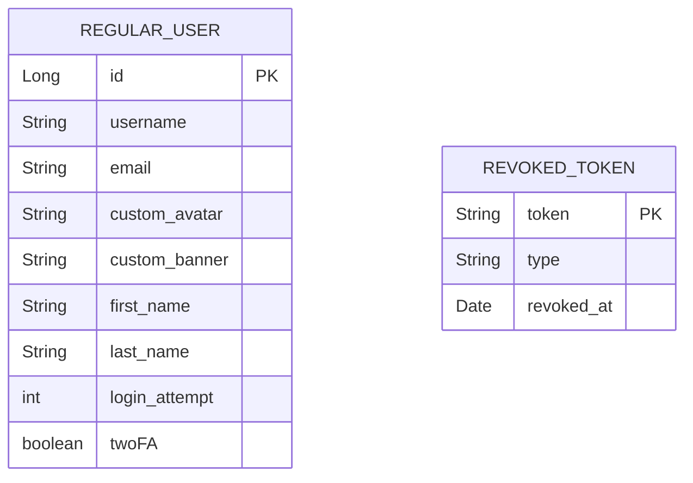

# Description
**Regular User service** is a microservice to manage external user.
 This service authenticate and authorize external user using JWT and Spring Security filtering chain
 REST endpoints are exposed to API Gateway for communication.

Tech stacks: Java Spring Boot, JPA (Hibernate ORM) and PostgreSQL.

Module:
  <ul>
    <li>Mandatory user management with user signup and login using email and encrypted password</li>
    <li>Allow users to interact with other users. (part - user profile)</li>
    <li>Standard user management and authentication. (part - update profile, upload avatar, profile)</li>
    <li>Implement a complete 2FA (Two-Factor Authentication) system for the users</li>
    <li>Backend as microservice. (part)</li>
  </ul>

Member worked on: Nguyen NGUYEN (hoannguy).
 

 

# Instructions
### Requirements
* Docker: `Docker version 28.2.2`
  * Docker compose: `Docker Compose version v5.0.1`
  * env file location: `backend/regular-user-service/.env`
      * 

        
Example of env file

        <pre>REGULAR_USER_H2_USER=
         REGULAR_USER_H2_PASS=
         REGULAR_USER_POSTGRES_DB=
         REGULAR_USER_POSTGRES_USER=
         REGULAR_USER_POSTGRES_PASSWORD=
         REGULAR_USER_JWT_KEY=
         REGULAR_USER_EMAIL=
         REGULAR_USER_APP_PASSWORD=
        </pre>

### Start as individual service
* Run locally <pre>export $(grep -v '^#' .env | xargs) ./mvnw spring-boot:run -Dspring-boot.run.profiles=dev</pre>
* Using Docker <pre>docker build -t regular-user-service . 
docker run --env-file .env -p 4445:4445 regular-user-service</pre>

 

# API Documentation

  
Auth API

    

      
<code>POST /v1/regular-user/auth/signup</code>

      <ul>
        <li>Description: Create a new account</li>
        <li>Payload: 
            <ul>
              <li>username</li>
              <li>email</li>
              <li>password</li>
            </ul></li>
        <li>Response code:
          <ul>
            <li>200: New user created.</li>
            <li>409: Username or email already existed.</li>
            <li>500: Something wrong in the server.</li>
          </ul></li>
        <li>Examples:
          <ul>
            <li><pre>/v1/regular-user/auth/signup</pre></li>
          </ul>
        </li>
        <li>
          

            
Json response example:

            <ul>
              <li>Request:<pre>/v1/regular-user/auth/signup
Body:
{
    "username": "Test",
    "email": "test@gmail.com",
    "password": "Test1234"
}</pre></li>
              <li>Response:
                <pre><code class="language-json">{
    "id": 1,
    "username": "test",
    "email": "test@gmail.com",
    "custom_avatar_url": "http://localhost:8085/images-regular/default_profile_avatar.jpg",
    "custom_banner_url": "http://localhost:8085/images-regular/default_profile_banner.jpg",
    "first_name": null,
    "last_name": null,
    "double_authentication": false
}</code></pre>
              </li>
            </ul>
          

        </li>
      </ul>
    

    

      
<code>POST /v1/regular-user/auth/signin</code>

      <ul>
        <li>Description: Sign in using either username or email.</li>
        <li>2FA: if 2FA is enabled, an email with One Time Password (OTP) will be sent to user. Response code 202.</li>
        <li>Payload: 
            <ul>
              <li>login</li>
              <li>password</li>
            </ul></li>
        <li>Response code:
            <ul>
              <li>200: Signed in ok.</li>
              <li>202: Need 2FA.</li>
              <li>401: Wrong credentials.</li>
            </ul></li>
        <li>Examples:
          <ul>
            <li><pre>/v1/regular-user/auth/signin</pre></li>
          </ul>
        </li>
        <li>
          

            
Json response example:

            <ul>
              <li>Request:<pre>/v1/regular-user/auth/signin
Body:
{
    "login": "test@gmail.com",
    "password": "Test1234"
}</pre></li>
              <li>Response without 2FA (code 200):
                <pre><code class="language-json">{
    "id": 1,
    "username": "test",
    "email": "test@gmail.com",
    "custom_avatar_url": "http://localhost:8085/images-regular/default_profile_avatar.jpg",
    "custom_banner_url": "http://localhost:8085/images-regular/default_profile_banner.jpg",
    "first_name": null,
    "last_name": null,
    "double_authentication": false
}</code></pre>
              </li>
              <li>Response with 2FA (code 202):
                <pre>2FA email sent to user. Call /v1/regular-user/auth/verify-otp with email and otp to login.</pre>
              </li>
            </ul>
          

        </li>
      </ul>
    

    

      
<code>GET /v1/regular-user/auth/refresh-token</code>

      <ul>
        <li>Description: Refresh access token.</li>
        <li>How this work: User needs to have a valid refresh token and an access token (can be expired).
             Access token is short-lived token (15min) used to verify user identity. It is verified for every request. Once access token expired, call this end point to get another access token.
             Refresh token is long-lived token (7days) used to manage user session and renew access token. If refresh token is invalid (expired or tampered), refresh request will be rejected and user will need to sign in again.
        <li>Response code:
          <ul>
            <li>200: Ok.</li>
            <li>401: Bad tokens.</li>
          </ul></li>
        <li>Examples:
          <ul>
            <li><pre>/v1/regular-user/auth/refresh-token</pre></li>
          </ul>
        </li>
        <li>
          

            
Json response example:

            <ul>
              <li>Request:<pre>/v1/regular-user/auth/refresh-token</pre></li>
              <li>Response:
                <pre><code class="language-json">{
    "id": 1,
    "username": "test",
    "email": "test@gmail.com",
    "custom_avatar_url": "http://localhost:8085/images-regular/default_profile_avatar.jpg",
    "custom_banner_url": "http://localhost:8085/images-regular/default_profile_banner.jpg",
    "first_name": null,
    "last_name": null,
    "double_authentication": false
}</code></pre>
              </li>
            </ul>
          

        </li>
      </ul>
    

    

      
<code>GET /v1/regular-user/auth/verify-otp</code>

      <ul>
        <li>Description: Verify OTP if 2FA enabled.</li>
        <li>How this work: When user signed in with 2FA enabled (code 202 when sign in). An email will be sent to user with OTP code (6 numbers). This code is valid for 5 minutes.
             Frontend should check if response code is 202, if it is the case, then prompt user to enter the OTP code received by email.
             The code should be sent to <code>/v1/regular-user/auth/verify-otp</code>
             Max 5 tries (401 when try 6th times), frontend should prompt user to sign in again.
        <li>Payload:
            <ul>
              <li>email</li>
              <li>otp</li>
            </ul>
        </li>
        <li>Response code:
            <ul>
              <li>200: Ok. User is now logged in.</li>
              <li>401: Email not exist or max attempts reached.</li>
              <li>400: Bad or expired OTP.</li>
              <li>500: Server error, try again later.</li>
            </ul></li>
        <li>Examples:
          <ul>
            <li><pre>/v1/regular-user/auth/verify-otp</pre></li>
          </ul>
        </li>
        <li>
          

            
Json response example:

            <ul>
              <li>Request:<pre>/v1/regular-user/auth/verify-otp</pre></li>
              <li>Response:
                <pre><code class="language-json">{
    "id": 1,
    "username": "test",
    "email": "test@gmail.com",
    "custom_avatar_url": "http://localhost:8085/images-regular/default_profile_avatar.jpg",
    "custom_banner_url": "http://localhost:8085/images-regular/default_profile_banner.jpg",
    "first_name": null,
    "last_name": null,
    "double_authentication": true
}</code></pre>
              </li>
            </ul>
          

        </li>
      </ul>
    

 

  
User API

    

      
<code>GET /v1/regular-user/user/profile/{id}</code>

      <ul>
        <li>Description: Get user profile with {id}. Note: Protected path. Require valid JWT tokens.</li>
        <li>Examples:
          <ul>
            <li><pre>/v1/regular-user/user/profile/1</pre></li>
          </ul>
        </li>
        <li>
          

            
Json response example:

            <ul>
              <li>Request:<pre>/v1/regular-user/user/profile/1</pre></li>
              <li>Response:
                <pre><code class="language-json">{
  "id": 1,
  "username": "test",
  "email": "test@gmail.com",
  "custom_avatar_url": "http://localhost:8085/images-regular/default_profile_avatar.jpg",
  "custom_banner_url": "http://localhost:8085/images-regular/default_profile_banner.jpg",
  "first_name": null,
  "last_name": null,
  "double_authentication": false
} </code></pre>
              </li>
            </ul>
          

        </li>
      </ul>
    

    

      
<code>GET /v1/regular-user/user/profile</code>

      <ul>
        <li>Description: Get current user profile. Note: Protected path. Require valid JWT tokens.</li>
        <li>Examples:
          <ul>
            <li><pre>/v1/regular-user/user/profile</pre></li>
          </ul>
        </li>
        <li>
          

            
Json response example:

            <ul>
              <li>Request:<pre>/v1/regular-user/user/profile</pre></li>
              <li>Response:
                <pre><code class="language-json">{
  "id": 1,
  "username": "test",
  "email": "test@gmail.com",
  "custom_avatar_url": "http://localhost:8085/images-regular/default_profile_avatar.jpg",
  "custom_banner_url": "http://localhost:8085/images-regular/default_profile_banner.jpg",
  "first_name": null,
  "last_name": null,
  "double_authentication": false
} </code></pre>
              </li>
            </ul>
          

        </li>
      </ul>
    

    

      
<code>PUT /v1/regular-user/user/profile</code>

      <ul>
        <li>Description: Update current user profile. Note: Protected path. Require valid JWT tokens.</li>
        <li>Payload:
            <ul>
              <li>Email</li>
              <li>first_name</li>
              <li>last_name</li>
              <li>double_authentication</li>
              <li>confirm_password</li>
            </ul></li>
        <li>Examples:
          <ul>
            <li><pre>/v1/regular-user/user/profile</pre></li>
          </ul>
        </li>
        <li>
          

            
Json response example:

            <ul>
              <li>Request:<pre>/v1/regular-user/user/profile
Body:
{
    "email": "test@gmail.com",
    "first_name": "Nguyen",
    "last_name": "NGUYEN",
    "double_authentication": true,
    "confirm_password": "Test1234"
}</pre></li>
              <li>Response:
                <pre><code class="language-json">{
    "id": 1,
    "username": "test",
    "email": "test@gmail.com",
    "custom_avatar_url": "http://localhost:8085/images-regular/default_profile_avatar.jpg",
    "custom_banner_url": "http://localhost:8085/images-regular/default_profile_banner.jpg",
    "first_name": "Nguyen",
    "last_name": "NGUYEN",
    "double_authentication": true
} </code></pre>
              </li>
            </ul>
          

        </li>
      </ul>
    

    

      
<code>DELETE /v1/regular-user/user/profile</code>

      <ul>
        <li>Description: Delete current user profile. Attribute confirm_deletion is boolean. Note: Protected path. Require valid JWT tokens.</li>
        <li>Payload:
            <ul>
              <li>confirm_password</li>
              <li>confirm_deletion</li>
            </ul></li>
        <li>Examples:
          <ul>
            <li><pre>/v1/regular-user/user/profile</pre></li>
          </ul>
        </li>
        <li>
          

            
Json response example:

            <ul>
              <li>Request:<pre>/v1/regular-user/user/profile
Body:
{
    "confirm_password": "Test1234",
    "confirm_deletion": true
}</pre></li>
              <li>Response:
                <ul>
                  <li>200: user deleted</li>
                  <li>401: wrong password</li>
                  <li>400: deletion not confirmed</li>
                </ul>
              </li>
            </ul>
          

        </li>
      </ul>
    

    

      
<code>PATCH v1/regular-user/user/profile/avatar</code>
 
      <ul>
        <li>Description: Update user avatar. Note: Protected path. Require valid JWT tokens.</li>
        <li>Require: 
          <ul>
            <li>Header: <code>Content-Type: multipart/form-data</code></li>
            <li>FormData must have "avatar" as key and the file to upload as value.</li>
            <li>FormData must have "confirm_password" to validate request</li>
            <li>Only .gif, .jpg, .jpeg, .png, .webp</li>
          </ul>
        </li>
        <li>Response code:
          <ul>
            <li>200: Successfully modified avatar</li>
            <li>400: Request must be multipart/form-data</li>
            <li>400: Invalid file (empty, not image) or no/wrong Content-Type header</li>
            <li>400: Invalid file extension. Allowed: .gif, .jpg, .jpeg, .png, .webp</li>
            <li>500: IO runtime error in server</li>
          </ul>
        </li>
        <li>Example<pre>/v1/regular-user/user/profile/avatar</pre></li>
      </ul>
    

    

      
<code>DELETE v1/regular-user/user/profile/avatar</code>

      <ul>
        <li>Description: Delete user avatar. Note: Protected path. Require valid JWT tokens.</li>
        <li>Require: 
          <ul>
            <li>FormData must have "confirm_password" to validate request</li>
          </ul>
        </li>
        <li>Response code:
          <ul>
            <li>200: Successfully deleted avatar</li>
            <li>404: File not found</li>
            <li>500: IO runtime error in server</li>
          </ul>
        </li>
        <li>Example<pre>/v1/regular-user/user/profile/avatar</pre></li>
      </ul>
    

    

      
<code>PATCH v1/regular-user/user/profile/banner</code>

      <ul>
        <li>Description: Update user banner. Note: Protected path. Require valid JWT tokens.</li>
        <li>Require: 
          <ul>
            <li>Header: <code>Content-Type: multipart/form-data</code></li>
            <li>FormData must have "banner" as key and the file to upload as value.</li>
            <li>FormData must have "confirm_password" to validate request</li>
            <li>Only .gif, .jpg, .jpeg, .png, .webp</li>
          </ul>
        </li>
        <li>Response code:
          <ul>
            <li>200: Successfully modified banner</li>
            <li>400: Request must be multipart/form-data</li>
            <li>400: Invalid file (empty, not image) or no/wrong Content-Type header</li>
            <li>400: Invalid file extension. Allowed: .gif, .jpg, .jpeg, .png, .webp</li>
            <li>500: IO runtime error in server</li>
          </ul>
        </li>
        <li>Example<pre>/v1/regular-user/user/profile/banner</pre></li>
      </ul>
    

    

      
<code>DELETE v1/regular-user/user/profile/banner</code>

      <ul>
        <li>Description: Delete user banner. Note: Protected path. Require valid JWT tokens.</li>
        <li>Require: 
          <ul>
            <li>FormData must have "confirm_password" to validate request</li>
          </ul>
        </li>
        <li>Response code:
          <ul>
            <li>200: Successfully deleted banner</li>
            <li>404: File not found</li>
            <li>500: IO runtime error in server</li>
          </ul>
        </li>
        <li>Example<pre>/v1/regular-user/user/profile/banner</pre></li>
      </ul>
    

    

          
<code>GET /v1/regular-user/user/signout</code>

          <ul>
            <li>Description: Sign user out. Note: Protected path. Require valid JWT tokens.</li>
            <li>Response:
              <ul>
                <li>200: Sign out successfully</li>
                <li>400: Problem with JWT tokens</li>
              </ul>
            </li>
          </ul>
        

 

    
Heath check API

    

    
<code>GET /v1/regular-user/health</code>

    <ul>
      <li>Description: Check if the service is healthy. </li>
      <li>Response code:
          <ul>
            <li>200: Healthy if service is up</li>
          </ul>
      </li>
    </ul>
  

 

# Folder Structure

Expand to show folder structure

<pre>
.
├── data/
│   └── (Local database files and persistence artifacts for H2)
│
├── src/
│   ├── main/
│   │   ├── java/
│   │   │   └── com/
│   │   │       └── example/
│   │   │           └── regular_user_service/
│   │   │               ├── configurations/
│   │   │               │   └── (Security and application configurations)
│   │   │               ├── controller/
│   │   │               │   └── (REST controllers: HTTP endpoints)
│   │   │               ├── dto/
│   │   │               │   └── (Data Transfer Objects and mapping logic)
│   │   │               ├── entities/
│   │   │               │   └── (JPA entities)
│   │   │               ├── exception/
│   │   │               │   └── (Custom application exceptions)
│   │   │               ├── repositories/
│   │   │               │   └── (Spring Data repositories)
│   │   │               ├── services/
│   │   │               │   └── (Business logic services)
│   │   │               ├── scheduler/
│   │   │               │   └── (Scheduled tasks)
│   │   │               └── RegularUserServiceApplication.java
│   │   │
│   │   └── resources/
│   │       └── (Application configuration, static files, and properties)
│   │
│   └── test/
│
├── Dockerfile
│   └── (Docker configuration for containerization)
├── mvnw/
│   └── (Maven Wrapper scripts)
├── pom.xml
│   └── (Maven project configuration)
├── README.md
│   └── (Project documentation)
├── runDocker.sh
│   └── (Script to run the application in Docker)
├── runLocal.sh
│   └── (Script to run the application locally)
│
└── target/                     (Compiled class files and resources)
</pre>

 

# Database Entity Relationship Diagrams (ERD)

 

# Resources
* [Learn Spring boot](https://www.codecademy.com/learn/paths/create-rest-apis-with-spring-and-java)
* [Spring annotation cheat sheets](https://github.com/Elma-dev/Spring_Boot_Annotations_Cheat_sheet?tab=readme-ov-file)
* [JJWT for Java JWT library](https://github.com/jwtk/jjwt)
* [2FA guide](https://howtodoinjava.com/spring-security/2fa-auth-with-jwt-token/)
* [Mermaids ERD tool](https://www.mermaidchart.com/)
* [Java language resources](https://www.baeldung.com/)
* [Mistral - Used as learning tool and occasional debug](https://mistral.ai/)
* [IDE Intellij IDEA](https://www.jetbrains.com/idea/)
