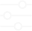
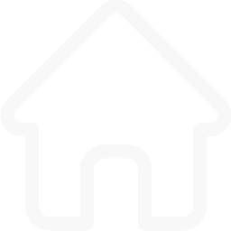

# Description
This section contains assets and information related to the visual design of the project.

Module:
  <ul>
    <li> Custom-made design system with reusable components, including a proper
color palette, typography, and icons. (1p)</li>
  </ul>

Member worked on: Nguyen NGUYEN (hoannguy).
 

 

# Figma prototype
* [XL - 1440 * 1024 (Desktop size)](https://www.figma.com/proto/q56ux8O9oemt6nCiS9q68Q/Transcendence?node-id=85-207&p=f&t=xLZuyDYqSOp3TFFI-0&scaling=min-zoom&content-scaling=fixed&starting-point-node-id=275%3A3243&show-proto-sidebar=1)
* [L - 1024 * 768 (Laptop size)](https://www.figma.com/proto/q56ux8O9oemt6nCiS9q68Q/Transcendence?node-id=85-207&p=f&t=xLZuyDYqSOp3TFFI-0&scaling=min-zoom&content-scaling=fixed&starting-point-node-id=275%3A3242&show-proto-sidebar=1)
* [M - 768 * 1024 (Tablet size)](https://www.figma.com/proto/q56ux8O9oemt6nCiS9q68Q/Transcendence?node-id=85-207&p=f&t=xLZuyDYqSOp3TFFI-0&scaling=min-zoom&content-scaling=fixed&starting-point-node-id=275%3A3241&show-proto-sidebar=1)
* [S - 480 * 720 (Mobile size)](https://www.figma.com/proto/q56ux8O9oemt6nCiS9q68Q/Transcendence?node-id=85-207&p=f&t=xLZuyDYqSOp3TFFI-0&scaling=min-zoom&content-scaling=fixed&starting-point-node-id=275%3A3240&show-proto-sidebar=1)
* [Error pages all size](https://www.figma.com/proto/q56ux8O9oemt6nCiS9q68Q/Transcendence?node-id=85-207&p=f&t=xLZuyDYqSOp3TFFI-0&scaling=min-zoom&content-scaling=fixed&starting-point-node-id=443%3A9440&show-proto-sidebar=1)
* [dev mode](https://www.figma.com/design/q56ux8O9oemt6nCiS9q68Q/Transcendence?node-id=240-3664&m=dev)

 

# Logo
- 

 

- 

 

 

# Design system
- ### Typography
  - Font: Monda. ([Available here](https://fonts.google.com/specimen/Monda))
  - Font weight:
    - Regular
    - Medium
    - SemiBold
    - Bold
  - Font base size: 1 rem = 16px 
  - Setup (size in rem):

    |   Name    |           Style           | Desktop | Laptop | Tablet | Mobile |
    |:---------:|:-------------------------:|:-------:|:------:|:------:|:------:|
    | Heading 1 |           Bold            |  3.75   |   3    |  2.75  |  2.25  |
    | Heading 2 |           Bold            |    3    |  2.5   |  2.25  |  1.75  |
    | Heading 3 |          Medium           |   2.5   |   2    |  1.75  |  1.5   |
    | Heading 4 |          Regular          |  1.75   |  1.5   |  1.25  |  1.25  |
    | Heading 5 |      Bold Uppercase       |  1.125  | 1.125  | 1.125  |   1    |
    |   Hero    |           Bold            |    6    |   5    |   4    |  3.25  |
    |  Body 1   |       Bold, Regular       |  1.125  | 1.125  | 1.125  |   1    |
    |  Body 2   | SemiBold, Medium, Regular |    1    |   1    |   1    | 0.875  |

 

- ### Colors
  - Red: #FF5959
  - Green: #62D868
  - Blue: #6AC8F8
  - White: #F8F8F8
  - Black: #202020
  - Grey: #D9D9D9
  - Dark Grey: #5B5B5B
  
 

- ### Icons
  | Name                 | Visual                                                                                | Description                                                        |
  |----------------------|---------------------------------------------------------------------------------------|--------------------------------------------------------------------|
  | Filter default       |    | Filter button icon in default state.                               |
  | Filter hover         |                                 | Filter button icon in hover state.                                 |
  | Filter arrow         |                           | Arrow for filter fields. Rotate 90 degree to indicate active state |
  | Chat menu            |                                         | Intranet navigation bar points to Chatting page.                   |
  | Group menu           |                                        | Intranet navigation bar points to Finder page.                     |
  | Project menu         |                                      | Intranet navigation bar points to Projects page.                   |
  | Todo menu            |                                   | Intranet navigation bar points to Tasks page.                      | 
  | Home menu            |                                         | Intranet navigation bar points to Intranet home page.              | 
  | Yes                  |                                     | Accept friend request.                                             |
  | No                   |                                      | Decline friend request.                                            |
  | Hamburger menu       |  | Hamburger menu for intranet mobile.                                |
  | Hamburger menu close |                                      | Close the hamburger menu.                                          |
  | Facebook social      |        | Facebook icon for campus social media.                             |
  | X social             |                                     | X icon for campus social media.                                    |                   

 

# Components
### Reusable components
| Name                    | Visual                                                              | Description                                                               |
|-------------------------|---------------------------------------------------------------------|---------------------------------------------------------------------------|
| Connector middle single |  | Use to build connector middle section, single indentation.                |
| Connector middle double |  | Use to build connector middle section, double indentation.                |
| Connector middle triple |  | Use to build connector middle section, triple indentation.                |
| Connector end middle    |       | Use to build connector middle section, precede non last element.          |
| Connector end           |          | Use to build connector end section, precede last element.                 |
| Big red button          |         | Use as primary button. Top is default state, bottom is hover state.       |
| Small red button        |       | Use as secondary button. Top is default state, bottom is hover state.     |
| Small blue button       |      | Use as non important button. Top is default state, bottom is hover state. |
| Filter field            |           | Use in filter panel (sort, filter and results per page).                  |

 

### Recommended Repeatable components
| Name                | Visual                                                         | Description                                                                     |
|---------------------|----------------------------------------------------------------|---------------------------------------------------------------------------------|
| Public nav bar menu |  | Use as nav link in public nav bar. State top to bottom: default, hover, active. |
| Tool section tile   |       | Tile to briefly show case a tool. Repeat for each tool.                         |
| Campus card         |     | Campus card to show campus information.                                         |
| Input field         |     | Use in sign in or sign up forms.                                                |
| Oauth login button  |     | Use in sign in page. Top is default, bottom is hover.                           |
| Intra nav link      |  | Use as nav link in intra nav bar. Left is default, right is hover and active.   |
| Friend tile         |       | Individual friend in friend list. Top is default, bottom is hover and active.   |
| Chat bubble         |     | Chat bubble. Top is friend text, bottom is user text.                           |
| Student card        |       | User card to show student information.                                          |

 

# Resources
* [Images and icons from Freepik](https://www.freepik.com)
* [Illustrations by catalyststuff on Freepik](https://www.freepik.com/author/catalyststuff)
* [Prototype by Figma](https://www.figma.com/)
* [Background remover](https://www.photoroom.com/tools/background-remover)
