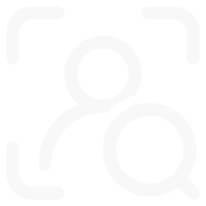
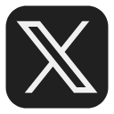

# Description
This section contains assets and information related to the visual design of the project.

Module:
  <ul>
    <li> Custom-made design system with reusable components, including a proper
color palette, typography, and icons. (1p)</li>
  </ul>

Member worked on: Nguyen NGUYEN (hoannguy).
 

 

# Figma prototype
* [XL - 1440 * 1024 (Desktop size)](https://www.figma.com/proto/q56ux8O9oemt6nCiS9q68Q/Transcendence?node-id=85-207&p=f&t=xLZuyDYqSOp3TFFI-0&scaling=min-zoom&content-scaling=fixed&starting-point-node-id=275%3A3243&show-proto-sidebar=1)
* [L - 1024 * 768 (Laptop size)](https://www.figma.com/proto/q56ux8O9oemt6nCiS9q68Q/Transcendence?node-id=85-207&p=f&t=xLZuyDYqSOp3TFFI-0&scaling=min-zoom&content-scaling=fixed&starting-point-node-id=275%3A3242&show-proto-sidebar=1)
* [M - 768 * 1024 (Tablet size)](https://www.figma.com/proto/q56ux8O9oemt6nCiS9q68Q/Transcendence?node-id=85-207&p=f&t=xLZuyDYqSOp3TFFI-0&scaling=min-zoom&content-scaling=fixed&starting-point-node-id=275%3A3241&show-proto-sidebar=1)
* [S - 480 * 720 (Mobile size)](https://www.figma.com/proto/q56ux8O9oemt6nCiS9q68Q/Transcendence?node-id=85-207&p=f&t=xLZuyDYqSOp3TFFI-0&scaling=min-zoom&content-scaling=fixed&starting-point-node-id=275%3A3240&show-proto-sidebar=1)
* [Error pages all size](https://www.figma.com/proto/q56ux8O9oemt6nCiS9q68Q/Transcendence?node-id=85-207&p=f&t=xLZuyDYqSOp3TFFI-0&scaling=min-zoom&content-scaling=fixed&starting-point-node-id=443%3A9440&show-proto-sidebar=1)
* [dev mode](https://www.figma.com/design/q56ux8O9oemt6nCiS9q68Q/Transcendence?node-id=240-3664&m=dev)

 

# Logo
- 

 

- 

 

 

# Design system
- ### Typography
  - Font: Monda. ([Available here](https://fonts.google.com/specimen/Monda))
  - Font weight:
    - Regular
    - Medium
    - SemiBold
    - Bold
  - Font base size: 1 rem = 16px 
  - Setup (size in rem):

    |                               Name                                |   Desktop    | Laptop | Tablet | Mobile |
    |:-----------------------------------------------------------------:|:------------:|:------:|:------:|:------:|
    |                             Heading 1                             |     6.5      |   3    |  2.75  |   3    |
    |                             Heading 2                             |      3       |  2.5   |  2.25  |  1.75  |
    |                             Heading 3                             |     2.5      |   2    |  1.75  |  1.5   |
    |                             Heading 4                             |     1.75     |  1.5   |  1.25  |  1.25  |
    |                             Heading 5                             |    1.125     | 1.125  | 1.125  |   1    |
    |                               Hero                                |      6       |   5    |   4    |  3.25  |
    |                              Body 1                               |    1.125     | 1.125  | 1.125  |   1    |
    |                              Body 2                               |      1       |   1    |   1    | 0.875  |

 

- ### Colors
  - Red: #FF5959
  - Green: #62D868
  - Blue: #6AC8F8
  - White: #F8F8F8
  - Black: #202020
  - Grey: #D9D9D9
  - Dark Grey: #5B5B5B
  
 

- ### Icons
  | Name            | Visual                                                                              | Description                                           |
  |-----------------|-------------------------------------------------------------------------------------|-------------------------------------------------------|
  | Filter          |  | Filter button icon.                                   |
  | Chat menu       |                                       | Intranet navigation bar points to Chatting page.      |
- | Finder menu     |                                     | Intranet navigation bar points to Finder page.        |
  | Friend menu     |                                      | Intranet navigation bar points to Friend page.        |
  | Project menu    |                                    | Intranet navigation bar points to Projects page.      |
  | Todo menu       |                                 | Intranet navigation bar points to Tasks page.         | 
  | Home menu       |                                       | Intranet navigation bar points to Intranet home page. | 
  | Facebook social |      | Facebook icon for campus social media.                |
  | X social        |                                   | X icon for campus social media.                       |
- | 42 logo         |                                | 42 icon for Oauth login button                        |

 

# Components
| No | Name                         | Type      | Description                                                 |
|---:|------------------------------|-----------|-------------------------------------------------------------|
|  1 | Single Connector            | Connector | Straight connector.                                         |
|  2 | End Connector                | Connector | Elbow connector.                                            |
|  3 | Double Connector             | Connector | 2 Single connectors with predefined responsive gap.         |
|  4 | Connect Connector            | Connector | Single connector and End connector with predefined gap.     |
|  5 | Single Connect Connector     | Connector | Single connector and Connect connector with predefined gap. |
|  6 | Single End Connector         | Connector | Single connector and End connector with predefined gap.     |
|  7 | Big Red Button               | Button    | Big red CTA, big focus.                                     |
|  8 | Small Red Button             | Button    | Small red cta, medium focus.                                |
|  9 | Small Blue Button            | Button    | Small blue cta, small focus.                                |
| 10 | Oauth Button                 | Button    | Oauth button to log in.                                     |
| 11 | Filter Button                | Button    | Filter button for fitlering directories.                    |
| 12 | Intranet Navigation Bar Link | Button    | Intranet navigation individual link.                        |
| 13 | Input Field         | Field     | Custom input field.                                         |
| 14 | Multi Select Field  | Field     | Custom multi select field.                                  |
| 15 | Seclect Field       | Field     | Custom select field.                                        |
| 16 | Upload Field        | Field     | Custom file upload field.                                   |
| 17 | Finder Profile Card | Card      | Student profile card in finder search result.               | 
| 18 | Friend Search Card | Card      | Simple friend card in friend search result.                 |
| 19 | Friend Tab Card | Card      | Simple friend card in friend tab.                           |
| 20 | Tool Card | Card      | Service card for available services.                        |

 

# Resources
* [Images and icons from Freepik](https://www.freepik.com)
* [Illustrations by catalyststuff on Freepik](https://www.freepik.com/author/catalyststuff)
* [Prototype by Figma](https://www.figma.com/)
* [Background remover](https://www.photoroom.com/tools/background-remover)
